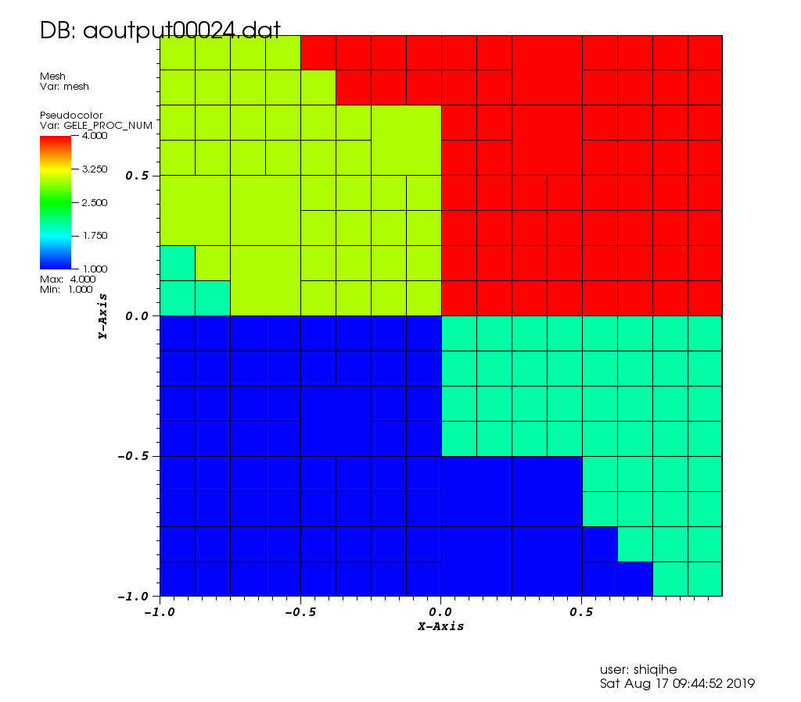
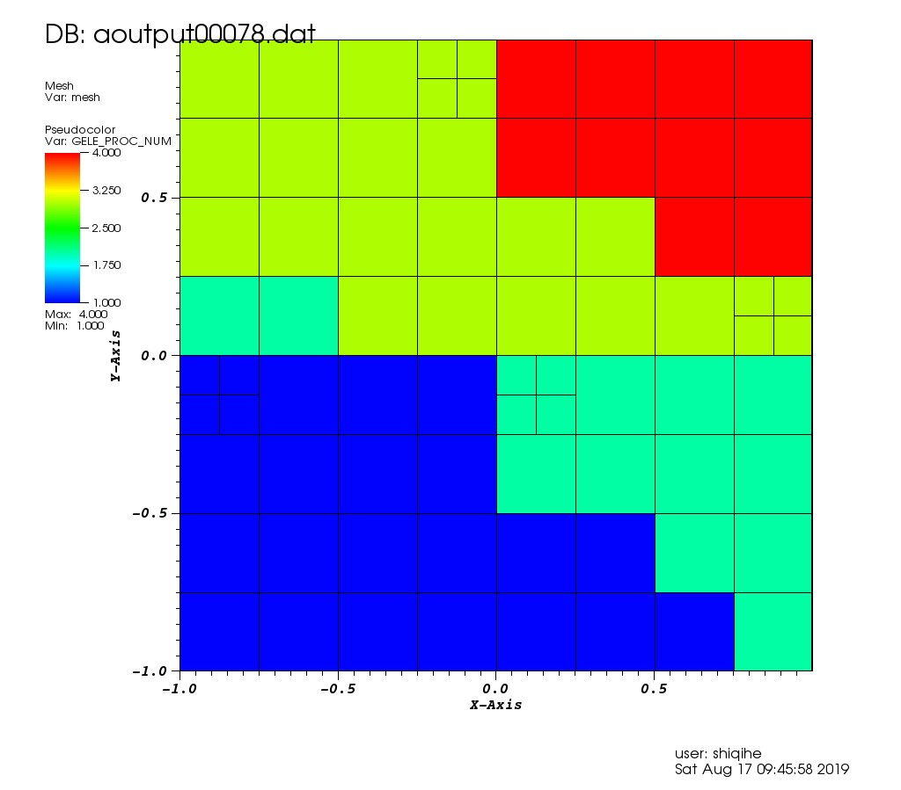
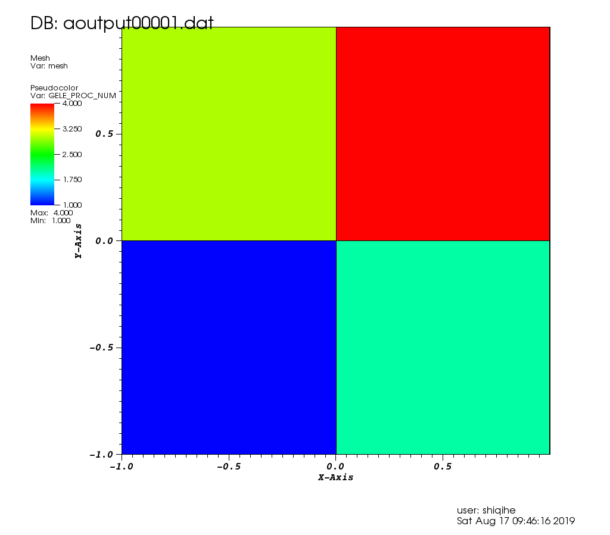

# Centralized load-balancing strategies

## Main idea
The main idea of this strategy is that all the processors send their computational load to processor P0. 
P0 then calculates the prefix sum of the load on elements ordered according to their global IDs. Then Processor zero
partitions the prefix sum array and broadcast the array to all the processors.  

## Element loads evaluation
The load on each element is
.
Where N is `the polynomial order +1`/ `number of the grid point in one direction`.  

## Steps
### On the root processor
1. Organize the load as a one-dimensional array of spectral elements. 
2. Compute the `prefix sum` of the 1D array.
3. Calculate the `Optimal Bottleneck` for each processor. 
4. Perform `H1` and `H2` Heuristics for partition. 
5. Reallocate the elements to each processor using `MPI_SCATTERV`

## Pseudo computational load
The program started with 4 elements and they are evenly allocated to 4 processors. The elements achieve `hp-adaptivity`. 
The upper-bound of the element h-refinement is 4, i.e., each element can split up to four times. The h-refinement is represented by
the variable `H_DEPTH` and it is initialized with `1`. `p` stands for the polynomial order. The polynomial order starts by `4` end with `12`. 

The code performs a random `hp-refinement` scheme, meaning that each element adapts randomly and there is no real numerical computation implemented inside the code. The program starts with `h-refinement`, each element has a 30% chance to split. Once an element's `H_DEPTH` reaches 2, it has a 30% chance to invoke `p-enrichment`. The load of each element is based on the `p-order`.

## Performance
 Here is the performance of the program:
 
 
 

 
  
 
 
 ## Distributed load balancing
 In `load_balancing.f90` subroutine `H1_PARTITION_LOCAL`, distributed load balancing is achieved. However, grid coarsen is not available yet. 
 
 The centralized load balancing has processor P0 in the critical path that determines how fast the load balancing may complete. In the distributed version, each processor collaborates with each other to have a local copy of the prefix sum of the load. The next step, each processor calculate the local element map and share the information globally so that a global map can form. 
 
 `MPI_EXCAN` is applied to obtain the global prefix sum. `MPI_ALLTOALLV` is used to transfer data.
 
 ### Strategy steps
 1. each processor calculates the weights of elements
 2. calculate the local prefixed sum by using `MPI_EXSCAN`
 3. last processor computes the `Optimal Bottleneck` and broadcasts it
 4. get the processor mapping
 5. `MPI_BCAST` the element re-allocate information among processors
 6. transfer elements by using `MPI_ALLTOALLV`
 7. Compute the load balancing ratio
 
